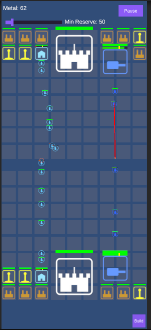

# BeyondAllRoyal

A mobile-first 2D RTS built in Unity, inspired by *Beyond All Reason* and *Clash Royale*, with a futuristic theme. Units move and fight autonomously — no micro required. Destroy the enemy HQ to win.

Built as a school project.



For the full game design (resources, map, units, buildings), see the [presentation](BeyondAllRoyal-Praesentation.pdf), [Requirements.md](Documentation/Requirements.md), and [UnitDesign.md](Documentation/UnitDesign.md). For current implementation status, see [Checklist.md](Documentation/Checklist.md).

A prebuilt Android APK is attached to each [tagged release](https://github.com/Adyrem/BeyondAllRoyal/releases).

## Requirements

- Unity **6000.4.5f1** (see `ProjectSettings/ProjectVersion.txt`)
- 2D (URP) template

## Project layout

```
Assets/Scripts/
  Core/       GameManager, ResourceManager, MapGrid registries, settings, input helpers
  Data/       ScriptableObjects — all unit/building stats live here, never hard-coded
  Buildings/  Building base class + subclasses (production, towers, Tesla, HQ, ...)
  Units/      Unit + UnitAI (autonomous move/attack)
  Map/        MapGrid, BuildingSlot
  AI/         NPCController (MVP opponent)
  UI/         HUD, shop panel, health bars, main menu controller
  Effects/    AttackBeamSpawner, ExplosionSpawner, ShootSfxSpawner — placeholder VFX/SFX
  Testing/    TestSceneBootstrap — pre-places starter buildings in TestScene
  Editor/     ProjectSetup's two menu items generate/wire ScriptableObjects, prefabs, sprites, and all
              three scenes' UI; MainMenuSetup/ThemeSetup/TestSceneSetup do the scene-specific work and
              are called from ProjectSetup, not run directly; UITheme holds the shared palette
```

Architecture details (data-driven stats, singleton conventions, building/unit hierarchy) are covered in the [presentation](BeyondAllRoyal-Praesentation.pdf).

## Git hooks

A pre-commit hook scans staged changes for likely leaked credentials (API keys, private keys, Android/iOS signing files, `.env` files, generic secret-looking assignments) and blocks the commit if it finds one. It's checked into `.githooks/` instead of `.git/hooks/` so it travels with the repo — enable it once per clone with:

```sh
git config core.hooksPath .githooks
```

A blocked commit that's a genuine false positive can be bypassed with `git commit --no-verify`, but treat that as the exception, not the default.
